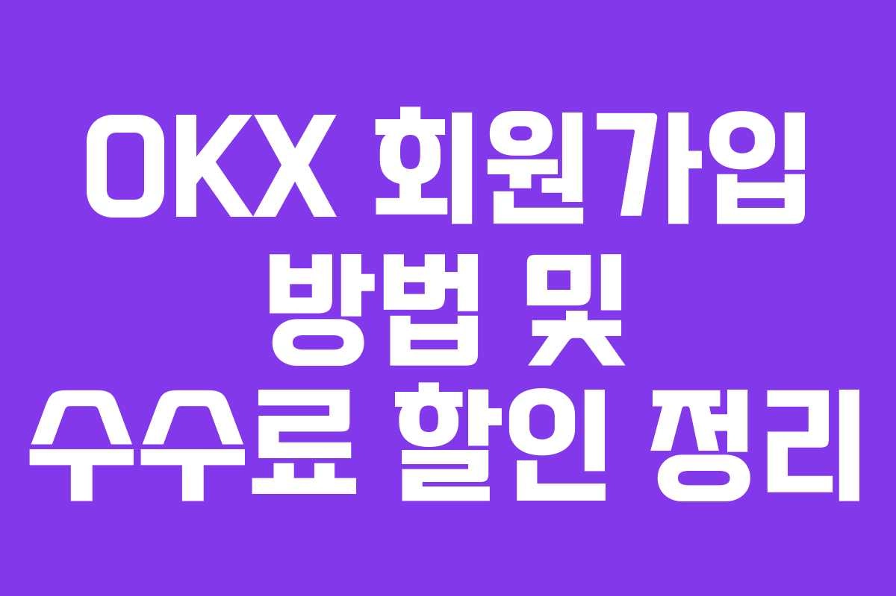

# OKX注册教程：20%手续费优惠完整攻略

---

想在OKX交易所交易加密货币，却不知道如何注册？担心错过手续费折扣优惠？本文为您详细拆解OKX注册全流程——从账户创建到KYC认证，再到安全设置，每一步都配有实操指南。更重要的是，通过正确的注册方式，您可以**永久享受20%手续费返佣**，让每一笔交易都更省钱。

---

## 第一步：通过优惠链接注册

这是最关键的一步。如果直接从官网注册，你会错过手续费折扣。

正确做法：👉 [点击此处领取OKX永久20%手续费优惠](https://www.okx.com/join/62834398)

打开链接后，系统会自动填入邀请码**62834398**。注册页面应该显示"your commission kickback rate: 20%"字样——这说明优惠已生效。如果没看到这行字，说明优惠没有激活，建议重新打开链接。

## 第二步：填写注册信息

按以下顺序操作：

**1. 邮箱地址**  
输入你常用的邮箱，这将作为你的登录账号。

**2. 手机验证**  
- 保持国家代码为+82（韩国）或+86（中国）
- 输入手机号码
- 点击"获取验证码"
- 输入收到的6位数字验证码

**3. 选择居住地**  
根据实际情况选择国家/地区。如果在韩国居住，选择"South Korea"；如果在中国，选择对应选项。

**4. 设置密码**  
密码必须满足：
- 至少8个字符
- 包含大写字母
- 包含数字
- 建议加入特殊符号增强安全性

完成这些步骤后，基础注册就完成了。但要正常交易，还需要完成KYC身份认证。

<iframe width="100%" height="415" src="https://www.youtube.com/embed/C7Z-nSa-G-M" title="OKX注册教程视频" frameborder="0" allowfullscreen></iframe>

## 第三步：KYC身份认证

KYC（Know Your Customer）是反洗钱的必要程序。不完成KYC，无法进行充值和提现。

### 下载并打开OKX APP

在手机应用商店搜索"OKX"并下载官方APP。用刚才注册的邮箱和密码登录。

### 开始身份验证

进入APP后，系统会提示完成KYC认证。点击"开始认证"。

### 准备身份证件

可以使用以下任一证件：
- 驾驶证
- 身份证
- 护照

选择证件类型后，按提示拍摄证件正反面。注意光线充足，确保信息清晰可见。

### 人脸识别

拍摄证件后，需要进行人脸识别验证。按照屏幕指示完成面部扫描。

### 填写个人信息

**姓名填写：**
- 中文姓名：按身份证上的姓名填写
- 英文姓名：必须与证件上的拼音一致

**地址填写：**
- 可以用中文输入地址
- 系统会自动翻译成英文供你选择
- 确认翻译准确后提交

提交后，系统会进行审核。通常几小时内就能收到审核结果。

## 第四步：设置Google OTP安全验证

这一步非常重要。加密货币交易所是黑客的主要目标，启用双重验证可以大幅提升账户安全性。

**操作步骤：**

1. 在OKX APP中进入"安全设置"
2. 选择"Authenticator app"
3. 如果没有Google Authenticator，先去应用商店下载
4. 复制OKX显示的设置密钥
5. 打开Google Authenticator，添加新账户
6. 粘贴设置密钥
7. Google Authenticator会生成6位动态验证码
8. 输入验证码完成绑定

完成后，每次登录或转账时，都需要输入Google Authenticator生成的动态密码。虽然多了一步操作，但安全性大大提升。

## 第五步：领取新人奖励

注册完成后别急着交易。先去"Rewards center"（奖励中心）看看。

OKX经常为新用户准备手续费优惠券或交易体验金。这些奖励是随机发放的，有的用户能领到价值不小的福利。

进入奖励中心后，点击"领取"按钮，可用的奖励会自动添加到账户。

## 常见问题解答

**为什么必须完成KYC认证？**  
KYC认证是全球加密货币交易所的监管要求，用于防止洗钱和欺诈行为。不完成KYC，无法使用充值、提现等核心功能。

**密码设置有什么要求？**  
密码至少8位，必须包含大写字母和数字。建议再加入特殊符号（如!@#$），并避免使用生日、电话号码等容易被猜到的信息。

**Google OTP是什么？怎么用?**  
Google OTP（一次性密码）是一种动态验证码，每30秒更新一次。登录或转账时，除了密码，还需要输入当前的OTP验证码。这样即使密码泄露，黑客也无法登录你的账户。

**20%手续费优惠是永久的吗？**  
是的。只要通过专属链接注册并输入邀请码62834398，这个20%返佣比例会永久有效。每次交易，系统都会自动返还20%的手续费到你的账户。

**领取奖励有时间限制吗？**  
注册后尽快领取比较好。有些奖励可能有时效性，过期就无法领取了。建议完成注册和KYC认证后，第一时间进入奖励中心查看。

**KYC审核要多久？**  
大多数情况下，几小时内就能完成审核。高峰期可能需要24小时。如果超过48小时还未收到结果，可以联系客服查询。

---

## 总结

完成以上步骤后，你就拥有了一个功能完整的OKX交易账户。回顾一下关键点：通过优惠链接注册可以获得永久20%手续费返佣，完成KYC认证才能正常交易，设置Google OTP保障账户安全，别忘了领取新人奖励。

OKX作为全球领先的加密货币交易所，为新手提供了友好的注册流程和丰富的交易工具。无论你是想投资比特币、以太坊，还是探索DeFi和NFT，OKX都能满足你的需求。最重要的是，👉 [通过专属链接注册](https://www.okx.com/join/62834398)，让每一笔交易都更划算。
